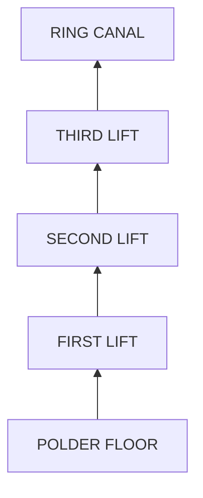

Four stages carry the water from the floor of the polder to the ring canal.
Each block is one stage, drawn to the lift it does. No single mill could raise
water the full **3.5 metres**, so they were built in series and the gain was
divided between them.
