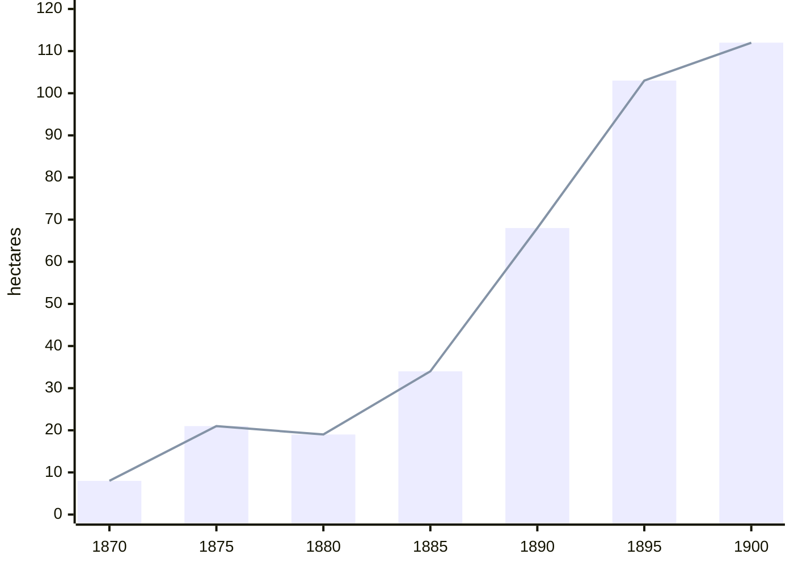

```mermaid
xychart-beta
  x-axis [1870, 1875, 1880, 1885, 1890, 1895, 1900]
  y-axis "hectares" 0 --> 120
  bar [8, 21, 19, 34, 68, 103, 112]
  line [8, 21, 19, 34, 68, 103, 112]
```

Reclaimed hectares per five-year period. The curve turns in ==1885==, the year
the steam house took the deepest lift off the mills.
