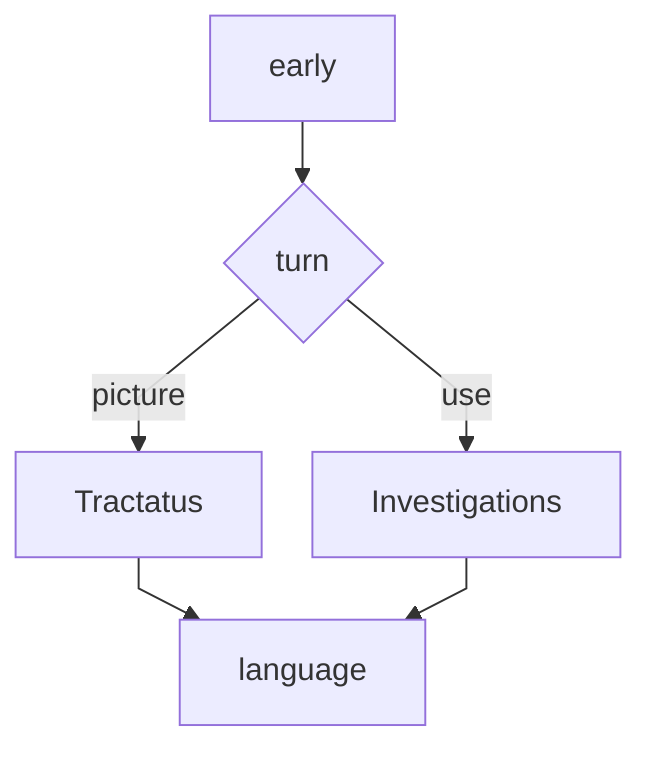

Considered by some to be ==the greatest philosopher of the 20th century==,
Wittgenstein played a central, if controversial, role in mid-20th-century
analytic philosophy. He continues to influence debate in topics as diverse as
logic and language, perception and intention, ethics and religion.

Two stages are commonly recognised. The early Wittgenstein is epitomised in
[Tractatus Logico-Philosophicus]{.ul .c1}; the later, in
[Philosophical Investigations]{.ring .c4}, took the more revolutionary step of
critiquing all of traditional philosophy including his own early work. The new
philosophy is heralded as ==anti-systematic through and through=={.c3}, yet
still conducive to genuine understanding of the traditional problems.

In more recent scholarship [this division has been questioned]{.ul .c1}: some
interpreters claim a unity between all stages, others a more nuanced division
with a middle and a post-later Wittgenstein.
